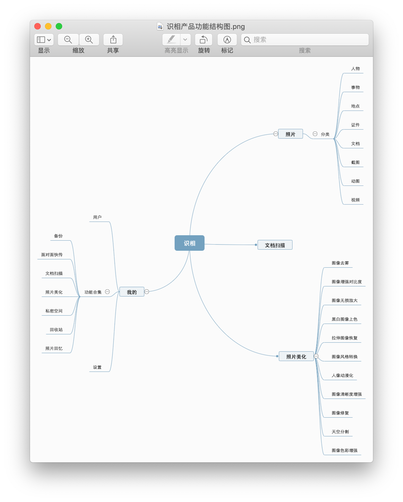
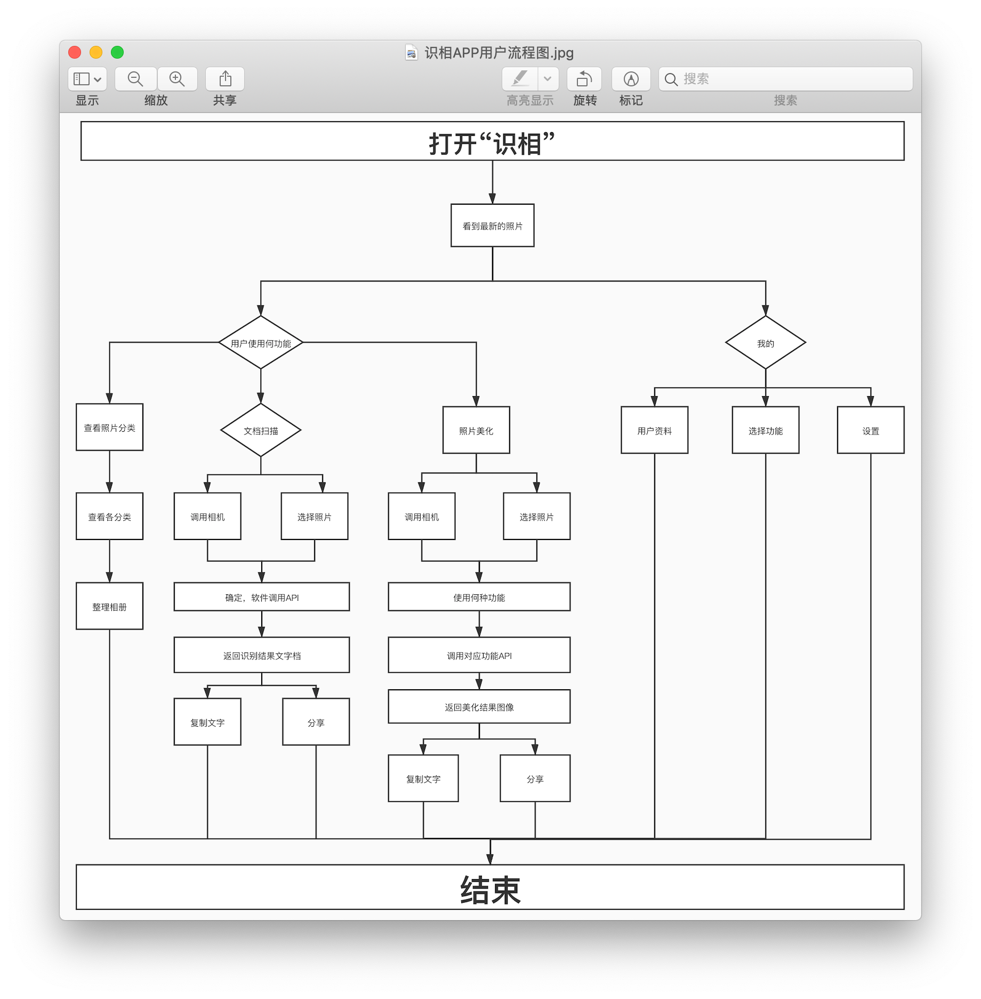

# 📷Insight ————“识相”APP项目

原型预览:[点击跳转](https://wp.autumnhui.cn/insight/)

---

## 产品概览 

| 文档名称 | 识相-产品需求文档 |
| ---|---|
| 产品名称 | 识相 |
| 产品描述 | 一款利用图像识别、效果增强来帮助用户进行相册图像辅助整理、备份，解决在当下用户照片没有及时处理和避免照片占用过多存储空间的痛点的APP。
| 产品版本 | 1.0 |
| 文件现状 | 进行中 |
| 文件作者 | 丘天惠 |

## 加值宣言
笔者认为目前市场上现有的相册管理软件功能参差不齐，无法对相册中的照片进行高效的管理。此软件针对这个用户痛点和现今存在的此类API进行整合并优化。
在此软件中，用到的API类型有：物体和场景识别API，OCR文字识别API，图像效果增强API等；结合API进行功能的集合实现，以解决当下下用户照片没有及时处理和避免照片占用过多存储空间的痛点。

---

# 一、需求概述

## 1.产品背景
智能手机快速发展的同时，人们对手机相机的依赖越来越高，甚至在使用频率方面出现取代单反相机的现象。伴随这一现象出现的后果是用户手机中的照片越来越多，不论是随手拍、工作需求、文档传真、截屏等照片在当下使用后便存于手机中疏以整理，导致积累的照片数量越来越多，更难以整理，最终让手机存储空间变得臃肿不堪。

## 2.产品市场
在笔者对市面上现有的几款相册整理软件测试使用/进行时发现，能够实现单项功能（如OCR图像识别、照片分类）的软件不在少数，但是却没有能够完整地整合在一起，如若用户需要处理图像，可能需要下载两个及以上的软件进行处理。再者，时下人工智能的快速发展让图像的识别、处理变得简单。进而，通过结合各个功能让用户能够快速地整理图像的软件是用户所需的。

## 3.市场概述

### 3.1图像识别类市场概述

> 从 2012 年的 ImageNet 竞赛开始，深度学习在图像识别领域发挥出较大威力，在通用图像分类、图像检测、光学字符识别(Optical CharacterRecognition, OCR)、人脸识别等领域，最好的系统都是基于深度学习的。生物识别技术市场规模不断增大。 生物识别不仅是目前正进行的如火如荼的行业，同时也是在未来五年具有发展潜力的市场。预计 2020 年生物识别技术全球市场规模将达到 250 亿美元。 国内生物识别技术市场规模有望从 2015 年 100 亿元上升至 2020 年的 300 亿元。 2013 年的统计数据显示，人脸识别占比 23%。同时国际生物识别小组于 2009 年的研究结果表明指纹识别占据生物识别的 50%市场，人脸识别紧随其后占据 13%的份额。预计到 2020 年，人脸识别市场空间预计超过 40 亿元人民币。

根据目前的形势，图像识别/处理方面的技术已经基本上成熟，但是却不能够做到物尽其用。在相册整理一块，现有软件有如：一刻相册、谷歌相册等，皆未能充分利用现有技术进行集合，且数量也是相对较少的，有很大的发展进阶空间。

### 3.2市场特征

- 对于现今软件市场几近饱满的情况下，人们不愿意下载过多的软件。因此，能够集成多样功能的软件，用户的需求迫切。
- 计算机深度学习迅速发展，图像识别/处理技术得到进一步提升，更够对软件识别能力进行进一步的提升加成。
- 相册整理类软件相对较少，暂未出现能够占据市场大量份额的产品。

### 3.3发展优势

- 同类型产品少，竞争对手数量少，竞争力度小。
- 开发成本较低（主要功能通过调用API即可实现）。
- 减缓用户储存空间不足的使用情况。
- 功能实用，痛点明显，可以实在的解决问题。

---

# 二、核心价值（最小可行性产品）

在“识相APP”中为需要整理手机相册的用户提供更优的处理解决方案。

## 用户痛点

- 日常产出的照片占用了手机中大量的存储空间
- 相册中凌乱的照片集合在其中，难以进行整理
- 文档类型的照片需要放大才能看清
- 挑选图片、修图需要花费大量时间

---

# 三、用户分析

## 1.目标用户群

- 核心用户：18-30岁的经常使用手机存储相片或相关资料的青年群体。
- 主要用户：18-25岁的经常使用手机进行拍摄的青年群体。

## 2.用户画像及使用场景

使用场景：小良是一名新闻专业的大学生，同时也是一名摄影爱好者，使用着一台新款的aPhone 11 Pro Max，在这台手机三颗强大的摄像头的加持下，他能够利用这台手机拍出很多好照片。他每天都拍了很多照片，但是因为学业的原因，经常不能够及时处理拍的照片，导致相册中的照片越来越多，手机存储空间也变得不够用了。于是他使用“识相”APP，照片自动分类以供他挑选和整理，软件中的机器学习美化照片也帮助他有更多的想法来处理照片。

使用场景：阿蓝是一位在鹅厂上班的典型职（she）业（chu）女性，平常工作需要经常处理工作的材料，细心的阿蓝保存了很多材料的照片留底，以免出错；在非工作日，阿蓝也喜欢在周边游玩，喜欢拍很多照片发朋友圈， 但是拍照技术不到家，只能以数量来弥补，因此相册中保存了很多照片，直到手机存储空间不足的一天，她被推荐了“识相”APP，照片自动分类以供她挑选和整理，软件中的图像效果增强（美化）功能也让她爱不释手。

---

# 四、核心价值与用户痛点

| 用户痛点 | API加值 |
| :---: | :---: |
| 照片杂乱无章，难以整理 | 百度AI开放平台图像主体检测功能 |
| 电子材料照片需大量的人工进行处理 | 百度AI开放平台通用文字识别 |
| 照片效果不理想 | 百度AI开放平台图像效果增强 |

---

# 五、人工智能API加持与解决用户痛点

- 通用物体和场景识别 & 图像主体检测 API

| 功能优势 | 解决痛点 |
| :---: | :---: |
| *准确性高*:基于百度海量数据，利用深度学习技术及高精度算法不断迭代模型，准确率业界领先 | 保证识别的准确性以更好地分类 |
| *标签体系丰富* : 可识别出10万+物体及场景标签，并在不断丰富中，持续提供更精细的识别服务 | 完善分类体系，精准识别照片内容 |
| *主体定位、打标签* : 检测出图片中多个主体的坐标位置，并给出主体的大类标签和标签的置信度得分，对海量图片进行分类、打标签 |辅助物体识别，让结果更加精准。 |

- 通用文字识别(OCR) API

| 功能优势 | 解决痛点 |
| :---: | :---: |
| *支持多语种识别*: 通用文字识别、含位置信息版支持对中、英、法、俄、西、葡、德、意、日、韩、中英混合等多语种内容的识别，并支持中、英、日、韩四语种的类型检测 | 能够识别多种类型的字体内容，能解决大多数的识别问题 |
| *准确率高*：针对图片模糊、倾斜、翻转等情况进行了优化，鲁棒性强，识别速度快，且支持2W+大字库，总体识别准确率高达99% | 精准识别，错误率低，快速返回正确率高的结果。 |

- 图像效果增强 API

| 功能优势 | 解决痛点 |
| :---: | :---: |
| *创意功能多样* | 照片处理方式有更多的处理方式 |
| *修复照片* | 处理瑕疵照片，还原色彩 |

(总结)
(总结)
(总结)
(总结)
(总结)

---

# 六、需求列表

| API | 用户场景 |优先级 |
|:---:|:---:|:---:|
| 通用物体和场景识别 & 图像主体检测 | 软件分类相册中的照片类型 | 较重要 |
| 通用文字识别(OCR) | 识别照片中内容 | 重要 |
| 图像效果增强 | 对照片进行效果增强处理 | 重要 |

---

# 七、产品结构图

## 1.产品功能一览

## 2. 用户流程图

---

# 八、数据推理

|  | 问 | 答 |
|:---:|:---:|:---:|
| 1 | 页面的主要功能有哪些？ |相册概览和分类；文档识别；照片美化。 |
| 2 | 照片如何实现分类？ | 通过调用通用物体和场景识别 & 图像主体检测API返回图像的类别，给图片打上标签，进而分类。 |
| 3 | 用户图像数据会不会泄露？ | 我们使用百度AI智能平台，软件本身不存储用户照片的数据，只做调用API和展示给用户看。 |
| 4 | 如何调用API返回数据？ | 通过获取用户的照片以上传到百度AI平台提供的接口返回对应的数据。 |

---

# 九、产品原型

---

# 十、API运用

---

# 十一、API使用风险评估

---

# 十二、竞品分析

---

# 十三、产品未来迭代设想

---

# 关于

